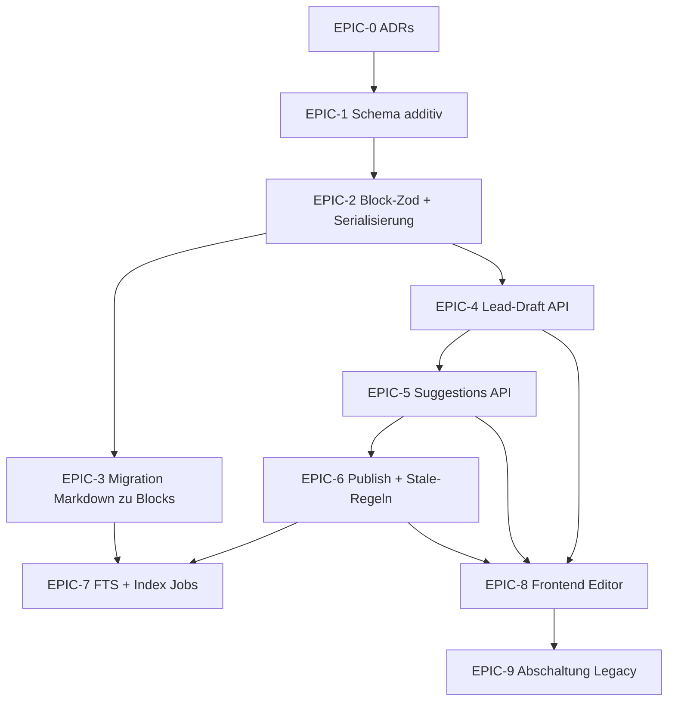

# Epic- und PR-Aufteilung: Blocks, Lead-Draft, Suggestions

**Bezug:** [Edit-System-Blocks-Suggestions-Lead-Draft.md](./Edit-System-Blocks-Suggestions-Lead-Draft.md), Konzept [new-edit-system.md](../../new-edit-system.md).

**Ist-Zustand (relevant):**

- `Document.content` + `DocumentVersion.content` sind **Markdown** (`apps/backend/prisma/schema.prisma`, Modelle `Document`, `DocumentVersion`).
- **Pro-User-Entwürfe:** `DocumentDraft` (`@@unique([documentId, userId])`) – weicht vom Zielbild „ein Lead-Draft“ ab.
- **PR-Pfad:** `DraftRequest` + Merge-Rechte (`canMergeDraftRequest` etc.) – wird durch Suggestions/Lead-Draft **ersetzt oder schrittweise abgelöst** (eigener PR „Deprecation“).

Ziel dieser Datei: **merge-fähige PR-Ketten** mit konkreten Dateipfaden (Prisma, Routes, Permissions, Services, Frontend, Jobs).

---

## Abhängigkeiten (Überblick)

---

## EPIC-0 – Entscheidungen festhalten (kein Produktcode oder minimal)

**Status: umgesetzt** – ADR [001](../platform/adr/001-blocks-suggestions-lead-draft.md); Block-Zod [blockSchema.ts](../../apps/backend/src/services/documents/blockSchema.ts) + [blockSchema.test.ts](../../apps/backend/src/services/documents/blockSchema.test.ts).

| PR        | Inhalt                                                                                                | Artefakte                                                                                                                       |
| --------- | ----------------------------------------------------------------------------------------------------- | ------------------------------------------------------------------------------------------------------------------------------- |
| **PR-0a** | ADR: Suggestion-Basis (`draftRevision` vs. `publishedVersion`), Stale-Regel nach Publish/Draft-Update | [docs/platform/adr/001-blocks-suggestions-lead-draft.md](../platform/adr/001-blocks-suggestions-lead-draft.md) (Abschnitte 1–2) |
| **PR-0b** | ADR: Lead-Draft Speicher **A** (Spalten auf `Document`) vs. **B** (eigene Tabelle)                    | gleiche ADR-Datei (Abschnitt 3)                                                                                                 |
| **PR-0c** | Block-Schema **v0** (Feldliste, `schemaVersion`, Beispiel-JSON)                                       | `apps/backend/src/services/documents/blockSchema.ts`, Tests `blockSchema.test.ts`                                               |

**Hinweis:** Erst ab **PR-1** echte Prisma-Migrationen, damit 0c optional vorziehbar bleibt.

---

## EPIC-1 – Prisma: additive Felder / neue Modelle

**Status: umgesetzt** – Migration `20260421220000_edit_system_draft_blocks_suggestions`; Schema: `Document.draftBlocks`, `Document.draftRevision`, `DocumentVersion.blocks`, `DocumentVersion.blocksSchemaVersion`, Modell `DocumentSuggestion` + Enum `DocumentSuggestionStatus`.

**Dateien:** `apps/backend/prisma/schema.prisma`, `apps/backend/prisma/migrations/20260421220000_edit_system_draft_blocks_suggestions/migration.sql`.

| PR        | Inhalt                                                                                                                                                                                                                            | Konkrete Modelle / Felder (Vorschlag)                                                                                        |
| --------- | --------------------------------------------------------------------------------------------------------------------------------------------------------------------------------------------------------------------------------- | ---------------------------------------------------------------------------------------------------------------------------- |
| **PR-1a** | **Published-Blocks** parallel zu Markdown: z. B. `publishedBlocks Json?`, `publishedSchemaVersion Int?` auf `Document` _oder_ JSON in `DocumentVersion` (entscheidet ADR – Versionierung spricht für Spalte an `DocumentVersion`) | **`DocumentVersion`:** `blocks Json?`, `blocksSchemaVersion Int?` (Umsetzung)                                                |
| **PR-1b** | **Lead-Draft** gemäß ADR A/B: z. B. `draftBlocks Json`, `draftRevision Int` auf `Document` _oder_ `DocumentLeadDraft` 1:1                                                                                                         | **`Document`:** `draftBlocks Json?`, `draftRevision Int` @default(0) (ADR A)                                                 |
| **PR-1c** | **`DocumentSuggestion`** (Status, `authorId`, `baseDraftRevision`, `ops Json`, Timestamps, optional `resolvedById`, `comment`)                                                                                                    | **Umsetzung:** + optional `publishedVersionId` → `DocumentVersion`, Indizes `(documentId, status)`, `(documentId, authorId)` |
| **PR-1d** | Relationen / Indizes nachziehen, `seed.ts` nur falls Testdaten neue Tabellen brauchen                                                                                                                                             | User-Relationen für Author/Resolver; **kein** Seed-Zwang (Defaults ausreichend)                                              |

**Wichtig:** `content` (Markdown) **nicht** in PR-1 entfernen – weiterer Lesepfad bis EPIC-9.

---

## EPIC-2 – Block-Validierung und Serialisierung (Backend-Library)

**Status: umgesetzt** – `blockDocumentSchema.ts` (Re-Export PR-2a), `markdownToBlocks.ts`, `blocksToMarkdown.ts`, `blocksPlaintext.ts`, Tests `blockSerialization.test.ts` (neben `blockSchema.test.ts`).

**Dateien (neu oder erweitern):**

- `apps/backend/src/services/documents/` – `blockSchema.ts` / `blockDocumentSchema.ts`, `markdownToBlocks.ts`, `blocksToMarkdown.ts`, `blocksPlaintext.ts`.
- Tests: `blockSchema.test.ts`, `blockSerialization.test.ts`.

| PR        | Inhalt                                                                                                       |
| --------- | ------------------------------------------------------------------------------------------------------------ | ------------------------------------------------------------------------------------------------------------------------------------------------------------------ |
| **PR-2a** | Zod-Schema für Top-Level-Dokument + `blocks[]`, `schemaVersion`; striktes Parse, klare Fehlermeldungen       | **`blockSchema.ts`** + Re-Export **`blockDocumentSchema.ts`**                                                                                                      |
| **PR-2b** | **Markdown → Blocks** (Import-Pfad für Migration und Upload) + **Blocks → Markdown** (Export für PDF/Pandoc) | **`markdownToBlocks.ts`** (`markdownToBlockDocumentV0`), **`blocksToMarkdown.ts`** (`blockDocumentV0ToMarkdown`) – minimaler Parser, kein vollständiger CommonMark |
| **PR-2c** | Plaintext/FTS-Vorbereitung: eine Funktion „searchable string aus Blocks“ (für EPIC-7)                        | **`blocksPlaintext.ts`** (`blockDocumentV0ToSearchableText`)                                                                                                       |

Keine Änderung an Fastify-Routen nötig, wenn nur Library + Tests.

---

## EPIC-3 – Datenmigration: bestehende Dokumente

**Status: umgesetzt** – Service `documentBlocksBackfill.ts`, Job `documents.blocks.backfill`, Script `pnpm run backfill-document-blocks`, GET `GET /documents/:id` + `GET .../versions/:versionId` mit Block-Feldern, Publish/Merge/Seed schreiben `blocks` bei neuen Versionen.

**Dateien:**

- `apps/backend/src/services/documents/documentBlocksBackfill.ts` (+ `documentBlocksBackfill.test.ts`)
- `apps/backend/scripts/run-backfill-document-blocks.ts`, `apps/backend/package.json` (`backfill-document-blocks`)
- `apps/backend/src/jobs/jobRegistry.ts`, `apps/backend/src/jobs/jobTypes.ts`
- `apps/backend/src/routes/documents.ts`, `apps/backend/src/services/documents/documentService.ts`, `apps/backend/src/seed.ts`

| PR        | Inhalt                                                                                                                                                   |
| --------- | -------------------------------------------------------------------------------------------------------------------------------------------------------- | ---------------------------------------------------------------------------------------------------------------------------------------------------------------------------------------------------------------------------------------------------------- |
| **PR-3a** | Idempotenter Batch-Job: `Document` / `DocumentVersion` mit Markdown → befüllt `publishedBlocks` (oder nur Versionen, je nach ADR), setzt `schemaVersion` | **`DocumentVersion.blocks`** + `blocksSchemaVersion: 0`; Job + Script; Filter `blocks`/`draftBlocks` = DB-Null (`Prisma.DbNull`)                                                                                                                           |
| **PR-3b** | **GET-Lesepfad:** Wenn Blocks vorhanden → API liefert Blocks (oder beides: `content` deprecated + `blocks`); wenn nicht → weiter Markdown (Fallback)     | **`GET /documents/:documentId`:** `draftRevision`, `blocks` (aus `draftBlocks`), `publishedBlocks` + `publishedBlocksSchemaVersion` (aktuelle Version); **`GET .../versions/:versionId`:** `blocks`, `blocksSchemaVersion`; Markdown `content` unverändert |
| **PR-3c** | Optional: Draft-Initialisierung aus letztem Published für neue Lead-Draft-Spalten                                                                        | **`backfillDocumentDraftBlocks`** aus aktuellem `Document.content` (analog zu Versionen)                                                                                                                                                                   |

Betrifft v. a.: `apps/backend/src/routes/documents.ts`, `apps/backend/src/routes/schemas/documents.ts` (Response-Shape), ggf. `apps/backend/src/services/documents/documentService.ts`.

---

## EPIC-4 – Lead-Draft: API + Permissions

**Dateien:**

| Schicht     | Pfade                                                                                                                                                                                          |
| ----------- | ---------------------------------------------------------------------------------------------------------------------------------------------------------------------------------------------- |
| Routes      | `apps/backend/src/routes/documents.ts` (neue Unterrouten oder konsistente Pfadstruktur), `apps/backend/src/routes/schemas/documents.ts`                                                        |
| Services    | `apps/backend/src/services/documents/documentService.ts` (oder neues `leadDraftService.ts` im gleichen Ordner)                                                                                 |
| Permissions | **neu:** z. B. `apps/backend/src/permissions/canEditLeadDraft.ts`; Anbindung an `apps/backend/src/permissions/scopeLead.ts` (Lead-Erkennung existiert bereits)                                 |
| Bestehend   | `apps/backend/src/permissions/canWrite.ts`, `apps/backend/src/permissions/canRead.ts`, `apps/backend/src/permissions/canPublishDocument.ts` – Matrix abstimmen (Autor: read draft, kein PATCH) |
| Tests       | `apps/backend/src/routes/documents.test.ts`, `apps/backend/src/permissions/permissions.test.ts`                                                                                                |

| PR        | Endpoints (laut Konzeptplan §7)                                                                                        |
| --------- | ---------------------------------------------------------------------------------------------------------------------- |
| **PR-4a** | `GET .../documents/:id/draft` – Lead voll, Autor read-only + `draftRevision`                                           |
| **PR-4b** | `PATCH .../documents/:id/draft` – nur Lead, **If-Match / Body `expectedRevision`** → 409 bei Konflikt                  |
| **PR-4c** | Regeln aus `.cursor/rules/document-lifecycle.mdc`: Publish weiterhin **nicht** über generisches `PATCH /documents/:id` |

---

## EPIC-5 – Suggestions: CRUD + Lead-Aktionen

**Dateien:**

| Schicht     | Pfade                                                                                                                                                         |
| ----------- | ------------------------------------------------------------------------------------------------------------------------------------------------------------- |
| Prisma      | bereits EPIC-1 `DocumentSuggestion`                                                                                                                           |
| Service     | **neu:** `apps/backend/src/services/documents/documentSuggestionService.ts` (Ops anwenden, Statusübergänge, Überlappung nur sichtbar machen, kein Auto-Merge) |
| Routes      | `apps/backend/src/routes/documents.ts` + `apps/backend/src/routes/schemas/documents.ts`                                                                       |
| Permissions | **neu:** `canCreateSuggestion`, `canResolveSuggestion` (oder kombiniert mit Lead-Check); `apps/backend/src/permissions/index.ts` exportieren                  |
| Tests       | `documents.test.ts`, `permissions.test.ts`                                                                                                                    |

| PR        | Endpoints                                                                                              |
| --------- | ------------------------------------------------------------------------------------------------------ |
| **PR-5a** | `GET/POST .../documents/:id/suggestions`, `POST .../suggestions/:sid/withdraw` (Autor)                 |
| **PR-5b** | `POST .../accept`, `.../reject` (Lead); bei `baseDraftRevision` veraltet → **409** (Festlegung EPIC-0) |
| **PR-5c** | Ops-Engine minimal (`replaceBlock`, `insertAfter`, `deleteBlock` …) + Tests mit Fixture-JSON           |

---

## EPIC-6 – Publish: Draft → Version + Suggestion-Konsequenzen

**Dateien:**

- `apps/backend/src/services/documents/documentService.ts` (`publishDocument` o. Ä.)
- `apps/backend/src/routes/documents.ts` – bestehendes `POST .../publish` erweitern oder zweiten Pfad dokumentieren
- `apps/backend/src/permissions/canPublishDocument.ts`
- Regelwerk Stale: Service-Layer + optional Job

| PR        | Inhalt                                                                                                                                                                                                   |
| --------- | -------------------------------------------------------------------------------------------------------------------------------------------------------------------------------------------------------- |
| **PR-6a** | Publish aus **Lead-Draft-Blocks** → neue `DocumentVersion` (Inhalt als JSON oder serialisierter Snapshot laut ADR), `currentPublishedVersionId`, Markdown-Spalte ggf. nur noch denormalisiert aus Blocks |
| **PR-6b** | Nach Publish: `pending` Suggestions → `superseded` / `stale` / 409 bei erneutem Accept (laut EPIC-0)                                                                                                     |

---

## EPIC-7 – Suche & Jobs

**Dateien:**

- `apps/backend/src/services/search/searchIndexService.ts`
- `apps/backend/src/services/search/documentSearchFts.ts`, `documentSearchContains.ts` (Snippet/Plaintext-Quelle)
- `apps/backend/src/jobs/jobRegistry.ts`

| PR        | Inhalt                                                                                               |
| --------- | ---------------------------------------------------------------------------------------------------- |
| **PR-7a** | Index-Aufbau aus **Plaintext aus Blocks** (EPIC-2c), Fallback Markdown solange Migration nicht durch |
| **PR-7b** | Reindex-Job nach Block-Migration triggern oder in 3a integrieren                                     |

---

## EPIC-8 – Frontend

**Dateien:**

- `apps/frontend/src/pages/DocumentPage.tsx`
- Neu: `apps/frontend/src/components/documents/` (Tiptap-Editor, Suggestion-Liste, Lead-Ansicht)
- API-Client / Types: je nach Frontend-Struktur (z. B. `apps/frontend/src/api/` oder wo `fetch` gekapselt ist)

| PR        | Inhalt                                                                                      |
| --------- | ------------------------------------------------------------------------------------------- |
| **PR-8a** | API-Types + `GET document` / `draft` / `suggestions` anbinden (read-only für Autoren)       |
| **PR-8b** | Tiptap: Lead voll editierbar; Autor nur Suggestion-Erstellung (kein Draft-PATCH)            |
| **PR-8c** | Near-Realtime **minimal:** Polling oder ETag zuerst (Plan §5.4)                             |
| **PR-8d** | Entfernen / Ausblenden der parallelen Markdown-Quelle, wenn Backend nur noch Blocks liefert |

---

## EPIC-9 – Legacy abschalten

**Dateien:**

- `apps/backend/prisma/schema.prisma` – `DocumentDraft`, `DraftRequest` deprecaten/entfernen (nur nach Datenmigration)
- `apps/backend/src/routes/documents.ts` – alle Pfade zu persönlichen Drafts / DraftRequest-Merge
- `apps/backend/src/permissions/canMergeDraftRequest.ts`, ggf. `documentLoad.ts` Selektoren
- Frontend: PR-/Merge-UI falls vorhanden

| PR        | Inhalt                                                                                |
| --------- | ------------------------------------------------------------------------------------- |
| **PR-9a** | Feature-Flag aus; alte Endpoints 410/404 mit Hinweis                                  |
| **PR-9b** | Schema: `DocumentDraft` / `DraftRequest` entfernen oder archivieren; finale Migration |
| **PR-9c** | Doku: `docs/platform/`, [Umsetzungs-Todo.md](./Umsetzungs-Todo.md) aktualisieren      |

---

## Kurz-Checkliste „welche Datei bei welchem Thema“

| Thema                         | Primäre Dateien                                                                             |
| ----------------------------- | ------------------------------------------------------------------------------------------- |
| Speicher / Versionen          | `apps/backend/prisma/schema.prisma` (`Document`, `DocumentVersion`, neu: Suggestion, Draft) |
| HTTP API                      | `apps/backend/src/routes/documents.ts`, `apps/backend/src/routes/schemas/documents.ts`      |
| Domänenlogik                  | `apps/backend/src/services/documents/*.ts`                                                  |
| Leserechte / sichtbare Felder | `apps/backend/src/permissions/canRead.ts`, `documentLoad.ts`                                |
| Schreiben / Suggest           | `canWrite.ts` + neue `canSuggest` / `canEditLeadDraft`                                      |
| Publish / Lead                | `canPublishDocument.ts`, `scopeLead.ts`                                                     |
| Suche                         | `apps/backend/src/services/search/*`, `jobRegistry.ts`                                      |
| UI                            | `apps/frontend/src/pages/DocumentPage.tsx`, `components/documents/*`                        |
| Lifecycle-Regeln (Cursor)     | `.cursor/rules/document-lifecycle.mdc` bei neuen Übergängen anpassen                        |

---

## Empfohlene PR-Größe

- **PR-1** bis **PR-2**: klein halten (reviewbar).
- **PR-3** + **PR-4**: mittel; bei `documents.ts`-Explosion Zwischenrefactor: Handler in `apps/backend/src/routes/documents/` splitten _oder_ Logik nach `services/documents/` ziehen (bestehende Architekturregeln `.cursor/rules/backend-architecture.mdc` / `routes.mdc`).

---

_Letzte inhaltliche Abstimmung: mit [Edit-System-Blocks-Suggestions-Lead-Draft.md](./Edit-System-Blocks-Suggestions-Lead-Draft.md) Abschnitt 12 (Nächste Schritte) und Meilensteinen in [Umsetzungs-Todo.md](./Umsetzungs-Todo.md) verknüpfen._
